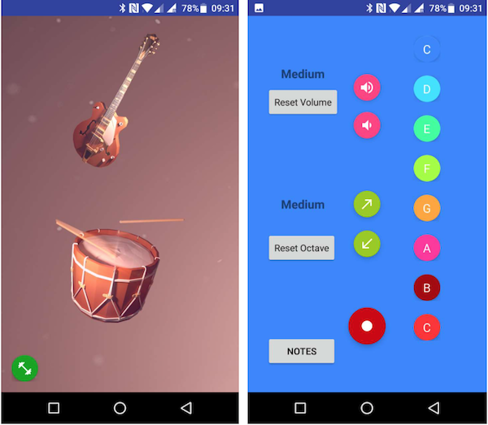
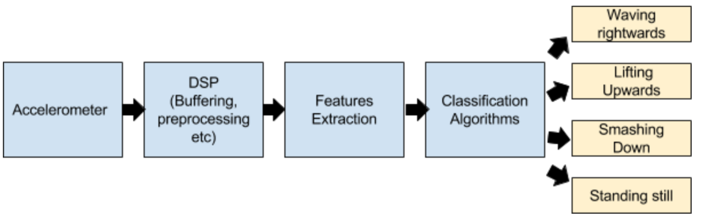
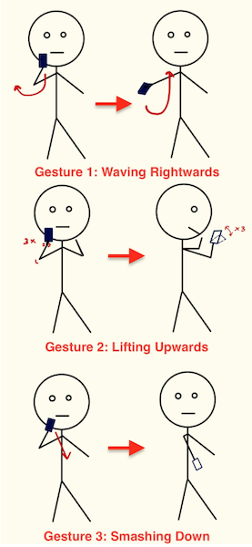
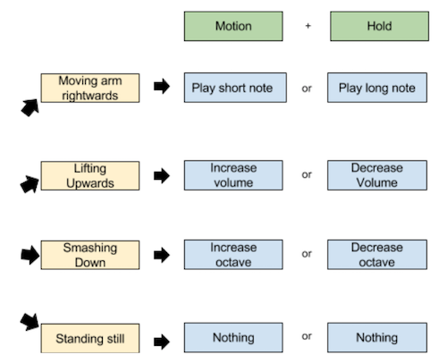
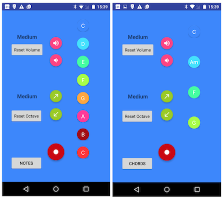
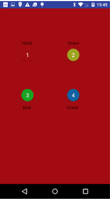
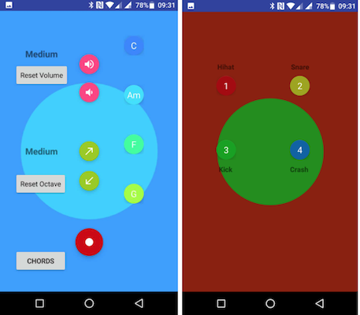
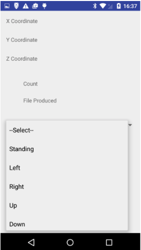
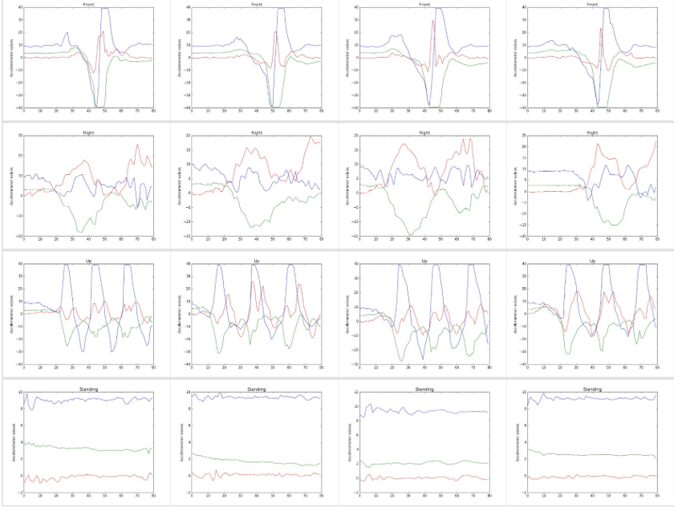
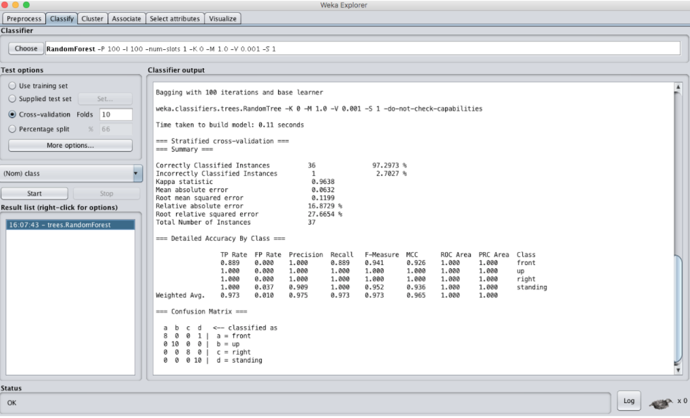

# CS4347 Sound and Music Computing Project
*Semester 2 2016/2017, Group 6, “From Motion to Music”*

---
## Section 1 Overview 

Our system implements a two-in-one instrumental Android app __comprising both a guitar and a drum__. The notes and chords of the guitar will be displayed on the app as buttons and pressing of a button, combined with a motion gesture, will play that note or chord of the guitar. When the motion is completed, the note will be played. Different gestures will be used to modulate the sound of the guitar such as increasing its volume or pitch and keeping the finger on the button while doing the motion will produce a reverse effect.

 
 *Figure 1: Main interface of our app*

### Features List
1.	Choose between playing the guitar or the drums
2.	Play different notes or chords of a guitar and modulate the notes
3.	Play different types of drums

### User Stories

__As a User, I want to..., So That I can ..., Remarks__

- Be able to choose between instruments, Play only the instrument intended, This is done by using different sound synthesis.
- Be able to change the pitch of the guitar note, Play more than one octave/play more notes, This can be done by smashing down the phone.
- Be able to change the volume of the notes I play on the guitar, Make music with ‘feeling’, This can be done by lifting the phone upwards three times.
- Be able to change the speed of the note being played, Play music pieces of varying tempo, This is moving the arm rightwards
- Be able to choose the note to play, I can perform a music piece, This is done by using the buttons on the screen

### High-Level System Architecture
In our system, we will analyse all three components of the accelerometer captured from the smartphone and use them to predict the user activity out of 4 possible choices of three different motion gestures or he or she is simply standing still. This can be seen in the figure below.

*Figure 2: High-level System Architecture*

The exact implementation of the system is detailed in the remaining sections of this report. 

---
## Section 2 Gestures and User Interface

### Gestures Captured by System
In our system, we analysed all three x, y, z components of the accelerometer captured from the Android smartphone. The signals are generated by a subject holding onto the phone with their hand and engaging in different physical motion gestures and we used them to predict the user activity out of 4 possible choices of waving rightwards, lifting upwards three times, smashing down or he or she is simply standing still. This can be seen in figure 3 below.

*Figure 3: Our 3 gestures*

### Design considerations of your selected gestures
When selecting the gestures, we tried to balance between the accuracy of gestures classification and ease of usage. 

With regards to accuracy, we applied DSP to process all of the three signals in real-time and extracted multiple time-domain features such as (RMS, LPC etc) and frequency domains features (like Power Spectral Density) from the buffers in the raw waveforms of a gesture. Hence, we experimented with multiple gestures and generally tried to pick gestures that can produce features that capture the similarities between signals in the same Gesture class and differences between signals in the different Gesture classes to increase the accuracy of the gesture classification.

We also considered the ease of usage and intuition of the gestures when used to trigger and change the sounds produced. We generally picked motion gestures that are easily executable and can represent the effect of the desired modulation. For example, the lifting upwards gesture will increase the volume of the notes played and the arm waving gesture which is like a conductor’s hand waving motion will play the note. The following diagram shows how our gestures modulate the sound.

*Figure 4: Mapping Between our Gestures and Sound Modulation*

### Overview of UI
As shown in the main interface of our app in Figure 1, the user is able to choose between 2 modes: guitar and drum. 

In guitar mode, the user can toggle between notes and chords. To play a note, the user clicks on that note/chord button to select it. He or she can then press the start button followed by doing the waving rightwards gesture to perform the sound. This could either be a short or long note depending on the motion. Similarly, performing an upwards lift gesture will increase volume while performing the smashing down will increase the octave. Holding onto the start button while performing the gesture will perform the opposite effect.

*Figure 5: Guitar Mode (Left: Notes, Right: Chords)*

In drum mode, the user simply chooses the type of drum sound to play followed by the shaking gesture to perform the sound. We have included four types of drums namely Hihat, Snare, Kick and Crash so that the user can choose the best type of drum that suits his or her needs.

*Figure 6: Drum Mode*

### UI Enhancements
We have also designed our app so that all of the buttons have distinct colors. Furthermore, we added animation effects to our app. When a button is clicked, a color ripple animation will appear that changes the entire background. This allows the user to easily tell exactly which note/chord or type of drum has been selected.

*Figure 7: Animated UI with Ripples Effect*

---
## Section 3 Sounds

Instruments Emulated & Discussion
For the sound signals, both synthesized audio and pre-recorded audio are used for the app. The synthesized audio is used to emulate guitar while pre-recorded audio is used to emulate drums acquired from https://realdrumsamples.com/. 

To synthesize the guitar sound, triangle waves are used as it is most similar to the actual sound waves of guitar. Furthermore, as each instrument have a unique tone due to the harmonics, the first three harmonics of the note is considered when creating the wave. 

ADSR is also used on the sound to make it more realistic. Various aspect of the guitar sounds are modulated. The first is to modulate the volume, which is done by changing the amplitude of the sound waves. The second modulation is to change the pitch of the note, which is done by increasing the MIDI value by 12. The last modulation is to change the length of the sound, which is done by increasing the percentage of the buffer for the sound wave is filled. 

### Combination of sounds 
Guitar and drums are most often used when playing together in a band. As we wanted people to have an app that can play different sounds together, choosing two instruments that are very popular and often played together becomes the most logical choice. As the instruments we are emulating are based off the real life instruments, we use the sounds to play a piece that utilizes the actual instruments in the song.

The chords help to harmonise the melody, giving more depth to the sound and song. The drums help to give an interesting rhythm and impact to the song. 

---
## Section 4 Algorithms/Techniques

Our main program logic is as follows: we have employed DSP, features extraction and also Machine Learning on features extracted from accelerometers readings for gestures detection. We then modulate the sound synthesised based on the gesture detected.

We will explain in details the algorithms that we used for each of these in the following sections.

### Accelerometer Buffering 
SensorManager class provided by Android was used to collect the motion signals of the user. By changing the default type of SensorManager to accelerometer, the readings of the accelerometer was obtained. The accelerometer readings are put into buffers of size 80, with an overlap of 25%. As the raw value of the accelerometer will be affected by gravity as well as presence of noise, a low-pass filter was first utilized to remove them from the raw values. We employed this accelerometer buffering in both our main app to process accelerometer buffers and our accompanying training app to collect training data.

### Training Data Acquisition
Training data for machine learning was acquired via a training data Android app that our group programmed ourselves. This app shown below can also be found in the source code folder that we submitted under the folder named trainingApp. The app is a simple data logger app that saves all of the accelerometer readings from the three x, y, z components corresponding to a particular gesture performed into labelled text files on the smartphone. We used this training app to perform our 3 selected gestures and acquire labelled data for training the machine learning classifier.

*Figure 8: Our training app to acquire labelled data per gesture*

We also wrote a Python script (parse.py in the trainingApp/trainingData) that can parse all of these text files and collate them into one big text file to be consumed by the main GuitarDrum app. We also programmed this script to plot the labelled data so that we can visualise it and get inspirations for the best differentiating features.

*Figure 9: Visualisation of the accelerometer component for each gesture helps us to identify possible good differentiating features*

All of these labelled data acquired was passed through the same features extraction library mentioned in the next section as though in real-time to acquire features values for training purposes.

### Features Extraction using jAudioGit
The filtered accelerometer values from each of the 3 components of the accelerometer were collected as a signal and this signal will undergo feature extraction to obtain time-domain features such as (RMS, PAR etc) and frequency domains features (like MFCC or Power Spectral Density). We also used several statistics-based features such as standard deviation, range, indices of peaks as we believe this could help differentiate the gestures based on the visualised plot shown in the previous section.

In our system, the feature extraction process is done using the jAudioGit library.  jAudioGit is a digital signal processing framework built for easy-use feature extraction. It takes a sequence of audio files as input and provide APIs to calculate over 50 types of audio features. For our system, we modified the source code within jAudioGit library to accept accelerometer samples as input rather than just audio files. These resultant features computed from the library were then written into an ARFF file used internally to create a gesture classifier model via the Random Forest classification algorithm by Weka.

### Prediction of Gestures via Machine Learning
Prediction of gestures is done using the Weka library and more precisely using the Random Forest classification algorithm, which is a class of popular machine learning algorithms. 

Firstly, the classification model is trained based on a large set of known labelled data that we acquired ourselves as mentioned earlier. For this stage, we explored and compared different types of classifier algorithms that could produce the highest accuracy and detailed accuracy by class for our set of features extracted using jAudioGit. We ultimately settled for the Random Forest Model as it produced outstanding results of 97% classification accuracy using 10 folds cross-validations as shown in the Figure below.

*Figure 10: Classification Results of Random Forest Model in Weka*

Once trained, the Random Forest model was used to run on unknown real-time accelerometer data to formulate a guess/prediction for the gesture. The key idea is to guess or predicting the class of a new sample (a signal buffer) based on previous knowledge of similar data. 

Once the correct physical activity is detected from the Samsung Galaxy J1 mini prime, our app will modulate the sound depending on which gesture is detected. For example, if it is detected that the motion is the waving rightwards motion and that the note currently being selected is the C note, it will now play a C note either as a short or long note depending on the exact user motion. Likewise, if the gesture is classified as a upwards lifting motion, the volume of the notes played will increase accordingly.

### Sound Synthesis for Guitar
To synthesize the guitar sounds, the AudioTrack class is used. Using the AudioTrack class, we can obtain the minimum buffer to fill for the waves. With this, it will be possible to know the shortest possible length of the sound and hence used to control the length of the sound we want. As the buffer size needs to be included when initiating the player, the buffer size is therefore initiated to be larger than the normal length of the sound played. This is to allow for sufficient buffer space when modulating the length of the sound. 

To create the sound wave, a buffer of short type is used. Depending on the note being selected, the app will calculate the midi value for the first, second and third harmonics and convert them to frequency. Using the frequency, we calculate the wave at each point. To prevent overflow, each signal is given a weightage instead of directly summing them together. As the base note is more prominent, it has a weightage of 0.45 and subsequently, the first harmonics, second harmonics and third harmonics  have lesser weightage at 0.3, 0.2 and 0.05 respectively. This is done for most parts of the buffer. If the note played is a short note, only a quarter of the buffer will be filled using this method and the rest is filled with 0.

An ADSR buffer of the same size as the sound is also created. A linear space (linspace) method is created to linearly spread the values. Using this linspace method, we create the ADSR buffer. We then multiply the wavepoint and the buffer at that point to obtain the signal at that point. However, as the signal buffer is of a short type due to the restriction of the AudioTrack class, the signal is not fully linear and has more of a staircase shape.

Chords creation are an extension of the sound creation. The base notes of the chord are hard-coded into the app and a placeholder is used to know which chord is selected. Each note is then treated like a sound and is created the same way as a sound would. Then, the notes are each given a weightage of 0.25 and summed together to form the chord.

### Sound Playback for Drums
For the drums, we recorded audio to play back through the app. We took accelerometer readings every 100ms and calculated the speed using the previous accelerometer readings. If the speed is above a set threshold, we will play a sound. 

---
## Section 5 Composition/Performance/Demo

For our demonstration, our group decided to play the nursery rhyme, Twinkle Twinkle Little Star. This song was chosen because it is simple, well-known and the chords used for this song are commonly used for other popular songs as well. For the last verse of the song, we play with a higher octave and volume to showcase the modulation capabilities as well as emotions.

We have 2 people playing the drums to give a slow rhythm. We then have 3 people on the guitar, two playing the melody and one playing the chords to give harmony to the song. We have one person conducting the song. 

---
## Section 6 Future Directions
Given more time, we would have liked to synthesize the drum sounds to play and also use machine learning for gestures for the drum. We would also like to make the synthesizing and gesture recognition faster so we can reduce latency between notes. This will allow for the songs that can be played to have less empty space between notes.

We would also like to make the playing of the chords easier so that instead of fixing 4 chords, we could provide more chords to the user. This would allow the user to play a more variety of songs. Nonetheless, the chords we used are the most common, so the user can still play the more common songs.

We would also like to improve on the modeling of the guitar sound. To model the guitar sound waves using mathematical formula, various variables need to be put into consideration such as the amount of force, direction of pick, angle of pick etc. As such, the current method of modeling is still incomplete as it does not take these into consideration. 

To do this, formulas found online can be used and analysed more in-depth in order to model the sound without having a huge delay time. Also, when playing the chords of the guitar, there will be some delay in between the sounds due to the strumming of different strings. This is not modelled in the current application and if it is done, will provide a more accurate guitar sound. This can possibly be done by manually inputting a delay based on the strings location to start the wave of the particular string at a different time. 

## References
		 	 	 								
- FREE Drum Samples - Download Hip Hop Drum Kits & Sounds. (n.d.). Retrieved April 08, 2017, from https://realdrumsamples.com/

- McEnnis, Daniel, Ichiro Fujinaga, Cory McKay, Philippe DePalle. 2005. "JAudio: A feature extraction library". ISMIR. McEnnis, Daniel, Ichiro Fujinaga. 2006. "jAudio: Improvements and additions". ISMIR. If using per-file analysis: McEnnis, Daniel, Ichiro Fujinaga. 2006. "jAudio: Additions and improvements". ISMIR. Constant-Q Transform: Santos, C., S. Netto, L. Biscainho, and D. Graziosi. 2004. A modified constant-Q transform for audio signals. IEEE ICASSP. 2: 469–72. (modified from the original in the most current versions - bins are weighted by percent of the spectrum it contains and the calculations were modified to extend over the entire window for each band) Area Polynomial Approximation McEnnis, Daniel. 2010. Polynomial approximation in Research Log Book 2nd Edition. 

- WEKA - licensed under the GNU General Public license (GPL 2.0 for Weka 3.6 and GPL 3.0 for Weka > 3.7.5). Any derivative work obtained under this license must be licensed under the GPL if this derivative work is distributed to a third party. The copyright for most WEKA code is owned by the University of Waikato.

